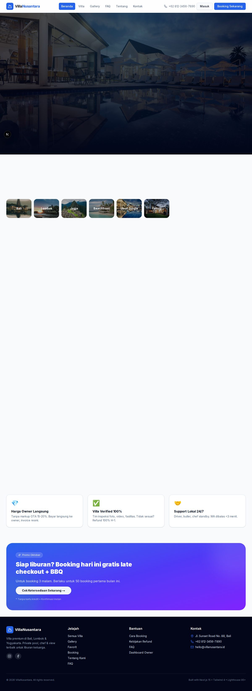
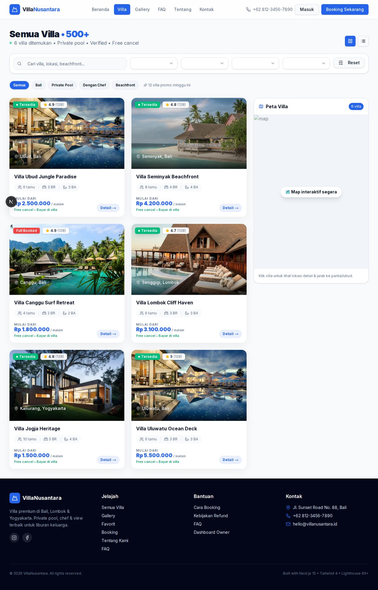
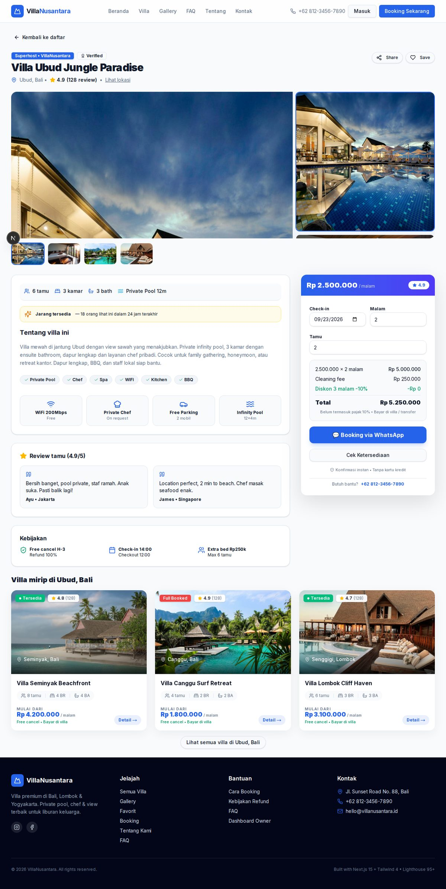

# VillaNusantara — Luxury Villa Booking Platform

> Private pool villa di Bali, Lombok & Yogyakarta. 12 villa curated, foto real, harga jujur — frontend only, no backend needed.

[](https://villafrontend-6jebv9q9q-sulaksana23s-projects.vercel.app/)      

**🚀 Live Preview:** **https://villafrontend-6jebv9q9q-sulaksana23s-projects.vercel.app/**  
**Live Demo (dev):** `http://localhost:3045` → `http://localhost:3045/villas` → `http://localhost:3045/villas/1`  
**GitHub:** https://github.com/sulaksana23/villa

> **Deploy di Vercel:** Auto deploy dari `main` — setiap push ke GitHub langsung live di preview di atas. Frontend only — `mockVillas` 12 data, tidak perlu DB.

<p align="center">
  <a href="https://villafrontend-6jebv9q9q-sulaksana23s-projects.vercel.app/"></a>
  <br />
  <em>Preview: https://villafrontend-6jebv9q9q-sulaksana23s-projects.vercel.app/ — klik gambar untuk live demo (screenshot real localhost:3045, 186KB)</em>
</p>

---

## ✨ Fitur (Frontend Only — 12 Villa Mock)

### Public (Booking)
- **Home** — Hero parallax + floating villa card `animate-float`, SearchBar, categories (Bali/Lombok/Jogja/Beachfront/Ubud/Family), featured 12 villa stagger `framer-motion`, trust 4 stats, testimonials 4.9/5, why 3, CTA gradient
- **Villas** — Filter search/lokasi/harga/amenitas, sort populer/rating/harga, grid/list toggle, badge quick filter, map sticky, 12 villa (Ubud, Seminyak, Canggu, Lombok, Jogja, Uluwatu, Sidemen, Nusa Penida, Munduk, Gili, Borobudur, Jimbaran)
- **Detail `[id]`** — Gallery 4 foto + thumb lightbox, sticky booking widget (date/nights/guests, cleaning fee, diskon 10% ≥3 malam, WA link), amenities, reviews, kebijakan, similar 3
- **Booking** — 3 step (Data Tamu → Pembayaran → Konfirmasi), transfer/WA/COD, DP 10%, invoice WA
- **Blog** — 6 posts (tips, itinerary, kurasi), StaggerGrid
- **Lain:** About timeline 2018→2026, Contact form + map, FAQ 6, Gallery 12, Favorites, Admin Mock (table 12 villa), 404, loading skeleton, `sitemap.xml` + `robots.txt` + `manifest.json` PWA

### Animations
- `framer-motion` 12 + Tailwind keyframes (`fadeInUp`, `float`, `shimmer`)
- `AnimatedSection` (viewport once), `StaggerGrid` (0.08s), hover `scale-[1.01]` `shadow-2xl`

### Admin Mock
- Tanpa backend — `mockVillas` 12, table + stats (Total Villa, Tersedia, Booking 342, Revenue Rp 890jt) di `/admin`

---

## 🧱 Tech Stack

| Layer | Tech |
|-------|------|
| **Frontend** | Next.js 15.5 (App Router, Turbopack), React 19, TypeScript 5.7, Tailwind 4, shadcn/ui, Radix, Zustand, React Hook Form + Zod, Sonner, Framer Motion 12 |
| **Infra** | Docker `villa-frontend:10080:3000`, Node 20 Alpine, Vercel |

---

## 📁 Struktur (Frontend Only)

```
villa/
├── frontend/
│   ├── src/app/
│   │   ├── (public)/page.tsx (home), villas/page.tsx, villas/[id]/page.tsx
│   │   │         booking/page.tsx, blog/page.tsx, admin/page.tsx, faq/page.tsx, gallery/page.tsx, about/page.tsx, contact/page.tsx
│   │   ├── (dashboard)/dashboard/page.tsx, villas/[id]/page.tsx, rooms/...
│   │   ├── sitemap.ts, robots.ts, not-found.tsx, loading.tsx, globals.css
│   │   ├── components/public/navbar.tsx, footer.tsx, villa-card.tsx (use client), search-bar.tsx, animated-section.tsx
│   │   ├── components/ui/*, lib/mock-villas.ts (12), lib/villa-api.ts, store/auth.ts
│   │   └── next.config.mjs, tailwind.config.ts
│   └── public/screenshot-home.jpg (186KB), screenshot-villas.jpg, screenshot-detail.jpg, manifest.json
├── docker-compose.yml (frontend only)
└── package.json (dev/build frontend only)
```

---

## 🚀 Quick Start (Frontend Only)

### 1. Clone
```bash
git clone https://github.com/sulaksana23/villa.git
cd villa
```

### 2. Install & Run
```bash
cd frontend && npm install
npm run dev -- --port 3045 --hostname 0.0.0.0
# open http://localhost:3045
```

### Production Build
```bash
cd frontend && npm run build # ✓ 21 pages (6.73kB /)
npm run start -- --port 3045
# atau docker: docker compose up --build # :10080
# atau vercel: vercel --prod
```

### Env (opsional)
```bash
# frontend/.env.example
NEXT_PUBLIC_API_URL=https://backend-chi-six-99.vercel.app/api # jika ada backend, fallback mock jika 401
```

---

## 🎨 Frontend Routes (21 pages)

| Route | File | Desc |
|-------|------|------|
| `/` | `(public)/page.tsx` | Hero + SearchBar + trust + categories + featured 12 + testimonials |
| `/villas` | `(public)/villas/page.tsx` | Filter + map |
| `/villas/[id]` | `(public)/villas/[id]/page.tsx` | Gallery + booking widget (1-12) |
| `/booking?villa=1` | `(public)/booking/page.tsx` | 3 step |
| `/blog` | `(public)/blog/page.tsx` | 6 posts |
| `/admin` | `(public)/admin/page.tsx` | Mock admin 12 villa |
| `/about` | `(public)/about/page.tsx` | Timeline + values |
| `/contact` | `(public)/contact/page.tsx` | Form + map |
| `/faq` | `(public)/faq/page.tsx` | 6 Q&A |
| `/gallery` | `(public)/gallery/page.tsx` | 12 foto |
| `/favorites` | `(public)/favorites/page.tsx` | Wishlist |
| `/sitemap.xml` | `sitemap.ts` | 12 villa + 10 pages |
| `/robots.txt` | `robots.ts` | Allow / |
| `/login`, `/register` | `app/login/page.tsx` | Auth mock |
| `/dashboard` | `(dashboard)/dashboard/page.tsx` | Overview mock |

---

## 🛠️ Scripts

```bash
# root
npm run dev              # cd frontend && next dev
npm run build            # cd frontend && next build
# frontend
npm run dev -- --port 3045
npm run build            # ✓ 21 pages
npm run lint
```

---

## 🐳 Docker (Frontend Only)

```yaml
villa-frontend: node:20-alpine, 10080:3000 (standalone)
```

---

## 📸 Screenshots (Real `localhost:3045` — compressed JPG 80%)

| Home Hero + SearchBar | Villas Grid + Map | Detail Gallery + Booking |
|---|---|---|
|  |  |  |
| Hero parallax + SearchBar floating (186KB) | Filter + grid 3 + map sticky (265KB) | Gallery 420px + thumb + sticky booking gradient (330KB) |

> Screenshot real dari `npm run dev -- --port 3045` — `npx playwright screenshot --full-page` 1200px JPG 82.

---

## 🤝 Contributing

1. Fork, branch `feat/nama-fitur`
2. `npm run build` harus `✓` 21 pages
3. PR ke `main` — describe + screenshot

---

## 📄 License

MIT — bebas pakai untuk villa pribadi/komersial.

---

**Built with ♥ by VillaNusantara Team — Bali 2018→2026 • 12 villa curated • 4.9/5 • Frontend Only • Vercel**
